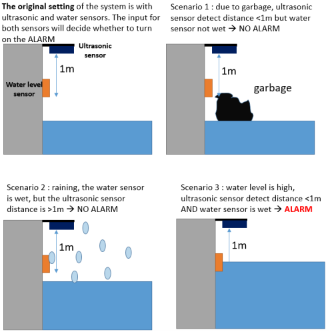
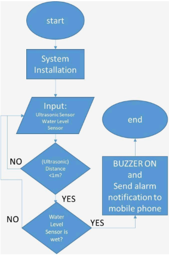
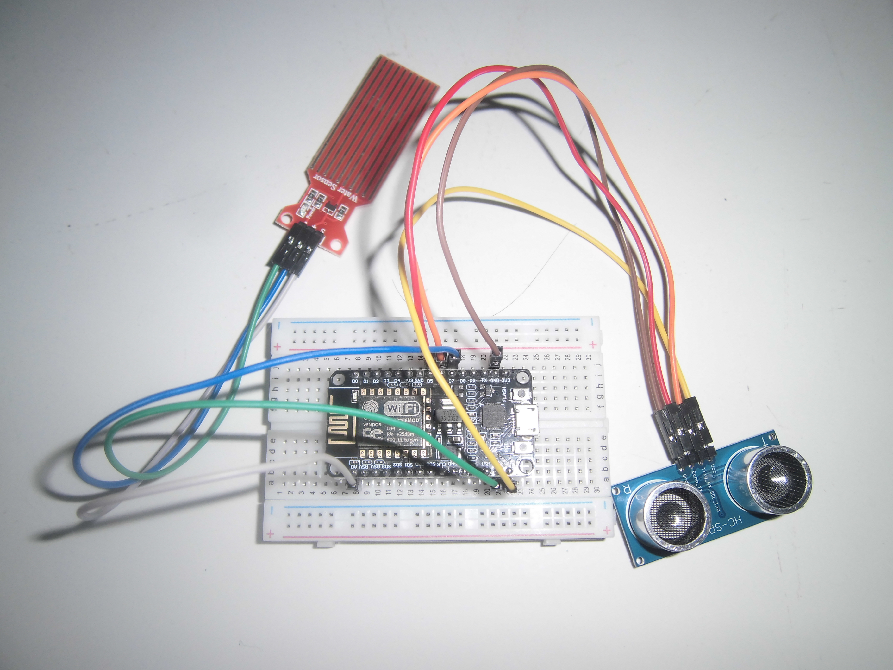

# Wireless Flood Early Warning System (FEWS) for High-Density Population Areas

<p align="center">
  
  
  
  
</p>

## 🏆 Achievement
* **Silver Medal** at an International Science and Invention Fair (November 2024).
* **Project Leader:** Muhammad Fadhael Izzil Haq.

## 📝 Overview
This repository contains the source code and documentation for an innovative, **ultra-low-cost (~Rp150,000 / $10 USD)** Wireless Flood Early Warning System (FEWS) designed specifically for high-density urban areas and river bottlenecks.

> 📢 **Portfolio Note:** This project was developed in October 2024 as part of an international competition. I'm publishing it here for my college application portfolio documentation.

A common flaw in traditional flood monitoring is the high rate of false alarms caused by debris, garbage, or heavy rain. This system solves that problem by introducing a **dual-sensor validation logic** that cross-references data from an ultrasonic sonar and a water level sensor before triggering any alerts.

### Key Features
* **Dual-Sensor Logic:** Eliminates false alarms caused by floating garbage or rainfall.
* **IoT & Wireless Alerts:** Powered by NodeMCU (ESP8266) to transmit real-time data and send instant emergency push notifications via IFTTT.
* **Audible Local Alarm:** Features a high-efficiency piezo buzzer to alert nearby residents instantly.
* **Low Cost & High Scalability:** Built entirely using budget-friendly, off-the-shelf components, making it highly accessible for developing communities.

---

## 🛠️ System Architecture & Logic

The system operates on three distinct use-case scenarios to ensure maximum reliability:

| Scenario | Ultrasonic (<1m) | Water Level (Wet) | System Status | Action |
| :--- | :---: | :---: | :---: | :--- |
| **1. Debris/Garbage** | ✅ YES | ❌ NO | **NO ALARM** | System ignores the obstruction. |
| **2. Heavy Rain** | ❌ NO | ✅ YES | **NO ALARM** | System ignores surface wetness. |
| **3. Actual Flood** | ✅ YES | ✅ YES | 🚨 **ALARM** | **Buzzer ON** + Sends IFTTT mobile notification. |




---

### System Flowchart


---

## 🔌 Hardware Components

* **Microcontroller:** NodeMCU ESP8266 (Built-in Wi-Fi)
* **Sensors:** * HC-SR04 Ultrasonic Sensor (Measures distance to water surface)
  * Resistance-based Water Level Sensor (Detects accumulation)
* **Alerts:** Piezo Buzzer (31Hz local audio alert)
* **Power Supply:** 3.7V Lithium Battery boosted to 5V via a Battery Shield



---

## 🚀 Getting Started

### Prerequisites
1. Install **Arduino IDE**.
2. Add ESP8266 Board Manager URL in Arduino IDE preferences.
3. Install necessary Wi-Fi and HTTP client libraries.
4. Set up an account on **IFTTT** and create a Webhook trigger to send notifications to your mobile phone.

### Installation & Deployment
1. Clone this repository:
   ```bash
   git clone [https://github.com/fadhaelizzil/low-cost-flood-early-warning.git](https://github.com/fadhaelizzil/low-cost-flood-early-warning.git)
2. Open the .ino file in /src using Arduino IDE.
3. Replace the placeholder credentials with your actual Wi-Fi SSID, Password, and IFTTT Webhook Key:
   * const char* ssid = "YOUR_WIFI_SSID";
   * const char* password = "YOUR_WIFI_PASSWORD";
   * const char* ifttt_key = "YOUR_IFTTT_WEBHOOK_KEY";
4. Flash the code onto your NodeMCU.
5. Assemble the hardware circuit as documented in the /hardware directory.
